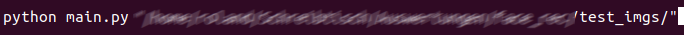
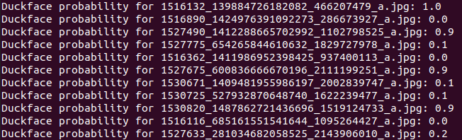
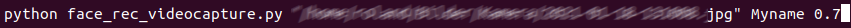

# duckface_detection
a classifier to detect a duckface from an image file.

## How to use

Pull from git.

The project has two operative modes: 
1) duckface detection from image files (.png, .jpg)
* run in the console `main.py "path_to_folder"` 
  
   
     

   * output is a duckface classification probability for each image in the folder
   1: duckface, 0: no duckface  
   

2) Live duckface detection from you webcam.

* run in the console `python face_rec_videocapture.py "path_to_imgage" Myname`.
  
  
  
  The script starts your webcam and compares each video frame to a known face ("path_to_image"). If your 
  face is recognized, your name is shown ("Myname"). Now try to make a duckface: the script should detect 
  this and issue a duckface alarm. 

  You can change the threshold of an image being classified as duckface using the "threshold" argument (must be between 0 and 1). The higher the threshold, the more likely "
  "a duckface alarm is issued"

## Image credits
All images are taken from the UCF Selfie Data Set:

https://www.crcv.ucf.edu/data/Selfie/

Mahdi M. Kalayeh, Misrak Seifu, Wesna LaLanne, Mubarak Shah, How to Take a Good Selfie?, in Proceedings of ACM Multimedia Conference 2015 (ACMMM 2015), Brisbane, Australia, October 26-30, 2015.

## Basic webcam face recognition script:
https://github.com/ageitgey/face_recognition/blob/master/examples/facerec_from_webcam_faster.py