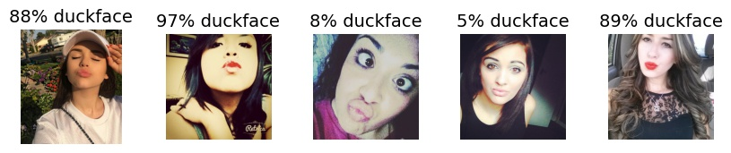

# duckface_detection
a classifier to detect duckfaces

## usage

### environment
In a `python3.7` (virtual) environment, install the dependencies via `pip install -r requirements.txt`

### duckface detection on a folder of images
* Create a folder containing images with human faces
* In the repo root folder, run `python src/duckface_probabilities.py _my_folder_`
* With the sample folder contained in the repo: python src/duckface_probabilities.py resources/sample_images`
     

 * For duckface probabilities, see the console output or the result plot in`results`

### live duckface detection on webcam
* run `python src/webcam_duckface_probabilities.py`
  The script starts your webcam and tries to detect a duckface on each frame. If a duckface is detected, the script should detect 
  this and issue an alert. 
  
* You can change the threshold of an image being classified as duckface using the "threshold" argument (must be between 0 and 1). The higher the threshold, the more likely "
  "a duckface alarm is issued"
  
## How does it work?
* We use the popular face_recognition project https://github.com/ageitgey/face_recognition to recognize faces on images and extract face landmark coordinates.
* Based on the face landmarks we calculate features like normalized positions, mouth width/height and distances of top/bottom and left/right lip corners.
* With these features, a duckface classifier is trained. To this end, we hand-picked duckfaces from the UCF Selfie Data Set.
* The trained model is in `resources`. It was trained on 212 images and reaches 88% duckface accuracy.

## Credits

### Images
All images are taken from the UCF Selfie Data Set:

https://www.crcv.ucf.edu/data/Selfie/

Mahdi M. Kalayeh, Misrak Seifu, Wesna LaLanne, Mubarak Shah, How to Take a Good Selfie?, in Proceedings of ACM Multimedia Conference 2015 (ACMMM 2015), Brisbane, Australia, October 26-30, 2015.

### Basic webcam face recognition script:
https://github.com/ageitgey/face_recognition/blob/master/examples/facerec_from_webcam_faster.py